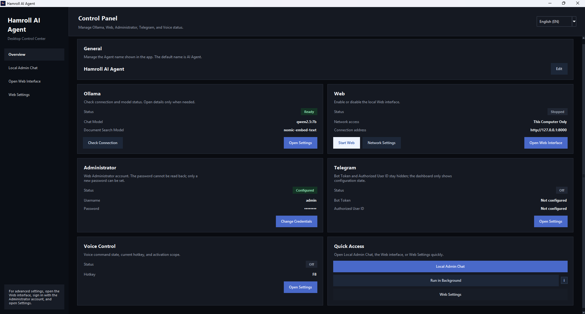
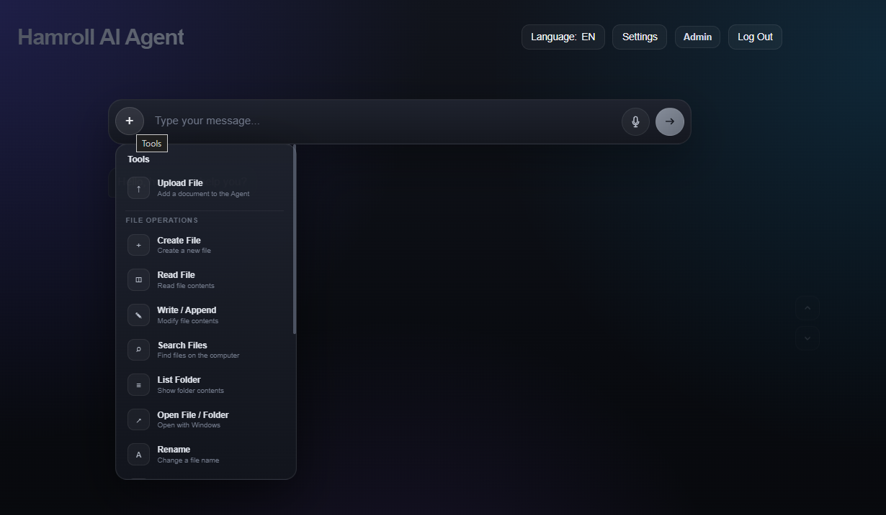
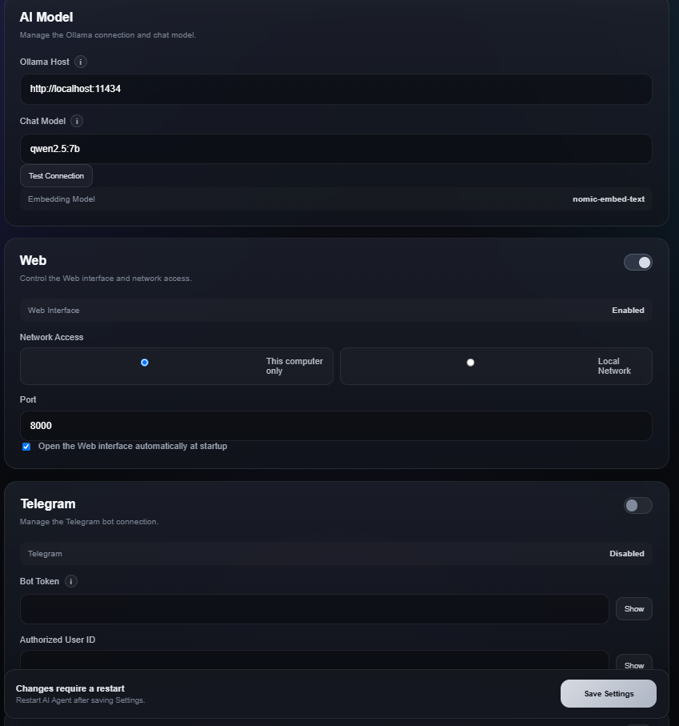
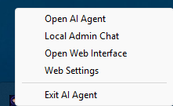

# Hamroll AI Agent

Hamroll AI Agent is a local AI agent project that adds desktop control, tool calling, document search, a Web interface, Telegram integration, and voice commands to local language models running through Ollama.

This project was not created to develop a new large language model. Its main purpose is to build an AI agent architecture from the ground up and understand how agents can call tools, work with local files under controlled permissions, and operate through different interfaces.

The agent uses existing models provided through Ollama. The chat model can be changed, and other Ollama-compatible models can be selected. A local embedding model is used for document search.

> Hamroll AI Agent was developed mainly for personal and local use on Windows. It is not designed to be exposed directly to the internet.

## Screenshots

### Desktop Control Panel

The desktop control panel shows the status of Ollama, the Web interface, Web Administrator, Telegram, and Voice Control. Related settings can also be opened from this panel.



### Local Web Interface

The Web interface allows users to chat with the agent, upload files, use voice input, and access the tools available for their permission level.



### Web Settings

The settings page can only be accessed from the local computer with an authorized Web Administrator account. Model, network, Telegram, user, voice, and other application settings can be managed from this page.



### System Tray

The application can continue running in the background. The system tray menu provides shortcuts to the desktop panel, Local Admin Chat, Web interface, and Web settings.



## Main Features

### Ollama Integration

* Uses local chat models running through Ollama.
* The Ollama server address and chat model can be changed.
* The Ollama connection can be tested from the application.
* Different Ollama-compatible chat models can be used.
* `nomic-embed-text` is used as the document search embedding model.
* Model operations are processed on the local computer.

### Agent and Tool Usage

The agent can analyze a user request and call the appropriate tool.

Main supported operations include:

* Create files
* Read files
* Write or append to text files
* Search for files
* List folder contents
* Open files or folders
* Rename files and folders
* Move files
* Delete files
* Send Telegram messages
* Send files through Telegram
* Search indexed documents
* View conversation history

User confirmation is required for risky operations such as modifying, moving, or deleting files. The request source, user type, and permissions are checked for each tool call.

### Local File Control

By default, file access is limited to the following user folders:

* Desktop
* Documents
* Downloads

Additional folders can be manually authorized for Local Admin. Project files, application data, databases, private configuration files, and critical Windows directories remain protected.

File operations through the Web interface are available only to the Web Administrator. Normal users and Guest users cannot use local file tools.

### RAG and Document Search

The application can add local document content to an embedding database and perform RAG-based document searches.

Main supported document types include:

* PDF
* DOCX
* XLSX
* PPTX
* TXT
* Markdown
* CSV
* JSON

Documents are processed locally. Embedding records and document content are not included in the GitHub repository.

### Desktop Interface

The desktop interface includes:

* General system overview
* Ollama and model status
* Web server status
* Web Administrator configuration
* Telegram configuration
* Voice Control settings
* Local Admin Chat
* Conversation histories
* System events
* Agent errors and activity logs
* Quick access options

The application can be minimized to the system tray and continue running in the background.

### Web Interface

The local Web interface can be used from a desktop browser or, when enabled, from another device on the same local network.

Two network modes are supported:

* This computer only: `127.0.0.1`
* Local network: access from devices on the same LAN

When LAN mode is enabled, a phone or another device connected to the same local network can access the Web interface.

The Web interface is not designed for direct internet access. The application does not provide built-in HTTPS, so port forwarding or public internet access is not recommended.

### Web User Roles

The Web system has three access levels.

#### Web Administrator

* Can view the conversation histories of all registered Web users.
* Can use permitted file tools.
* Can access local Web settings.
* Can manage user and system records.

The Web settings page requires a Web Administrator account and can only be opened from the computer running the application. Signing in as an Administrator from a LAN device does not provide access to the settings page.

#### Normal User

* Can chat with the agent.
* Can view only their own conversation history.
* Cannot use local file control tools.
* Cannot access administration settings.

#### Guest

* Can send a limited number of messages.
* Cannot view conversation history.
* Messages are not stored in the permanent conversation database.
* Cannot use file or administration tools.

### Telegram Integration

The Telegram Bot integration allows the agent to be used through an authorized Telegram account.

With the Telegram connection:

* Commands can be sent from a phone to the agent running on the computer.
* Information or actions can be requested from the agent.
* Permitted local file operations can be performed.
* Documents can be sent from the phone to the computer.
* Permitted documents on the computer can be sent to the phone through Telegram.

Tools available through Telegram remain limited by the existing file access rules.

Only requests from the configured Telegram User ID are accepted. The Bot Token and authorized User ID are not stored in the source code and are not included in the GitHub repository.

### Voice Control

The application includes local audio recording and Whisper-based speech-to-text support.

* Audio can be recorded through a microphone.
* An existing audio file can be selected.
* Audio is converted into text locally with `faster-whisper`.
* The detected text is placed in the message box first.
* The message is not sent to the agent automatically.
* Temporary audio recordings are not kept after processing.
* Voice Control can be enabled or disabled from the application settings.
* The default hotkey can be changed.
* The hotkey can be configured to work only while Local Admin is active or across the system.

### Conversation History and System Logs

Conversation histories are separated by source:

* Local Admin
* Telegram
* Web users

Normal Web users can access only their own history. The Web Administrator can view the histories of Web users. Guest messages are not added to permanent conversation history.

The Local Admin interface provides separate sections for conversation history, system events, and agent activity errors. History records can be cleared from the application settings.

### Concurrent Request Control

The agent does not run multiple model or tool requests at the same time. If the agent is already in use, a new request from another source is rejected with an appropriate busy message instead of being added to a queue.

This helps prevent Web, Telegram, and Local Admin requests or user identities from mixing with each other.

## Security Approach

The project includes the following security measures:

* Passwords are not stored as plain text.
* Web passwords are salted and hashed with PBKDF2.
* Telegram Bot Token and User ID are not stored in the source code.
* Session and CSRF checks are applied.
* Web settings require both local access and an Administrator account.
* Tool permissions are checked according to the request source and user.
* The project directory and application data directory are protected.
* Agent access to `.env`, database, and private configuration files is blocked.
* Writing to and deleting from critical Windows directories is blocked.
* Risky file operations require user confirmation.
* `shell=True` and `os.system` are not used for command execution.
* Private information is excluded from the GitHub repository.

The application was developed for personal and local use. LAN access should only be enabled on trusted networks.

## Application Data

Settings, databases, and private information created while the application is running are stored in the Windows user data directory instead of the project folder:

```text
%LOCALAPPDATA%\AI-Agent\
```

The following files may be created in this directory:

```text
agent_memory.db
web.db
rag_vectors.db
secrets.json
internal.json
config.json
```

These files contain user-specific data and are not included in the GitHub repository.

## Requirements

* Windows 10 or Windows 11
* Python 3.14
* Ollama
* At least one Ollama chat model
* The `nomic-embed-text` embedding model
* A working microphone for Voice Control
* A Telegram Bot Token and User ID if Telegram integration will be used

## Ollama Setup

After installing Ollama, download the chat model and embedding model:

```powershell
ollama pull qwen2.5:7b
ollama pull nomic-embed-text
```

`qwen2.5:7b` is the default example model. A different Ollama-compatible chat model can be selected according to the available system resources.

Check that the Ollama service is available:

```powershell
ollama list
```

## Python Setup

Create a virtual environment:

```powershell
python -m venv .venv
```

Activate the virtual environment:

```powershell
.\.venv\Scripts\Activate.ps1
```

Install the required packages:

```powershell
python -m pip install --upgrade pip
python -m pip install -r requirements.txt
```

Start the application:

```powershell
python main.py
```

Required configuration and database files are created automatically in the user data directory during the first run.

## Telegram Setup

Telegram integration is optional. It can remain disabled in the desktop or Web settings if it will not be used.

To configure Telegram integration:

1. Open the official `@BotFather` account in Telegram.
2. Send the `/newbot` command.
3. Choose a display name and a unique username for the bot.
4. Copy the Bot Token provided by BotFather.
5. Find your own Telegram User ID.
6. Open the Telegram settings in Hamroll AI Agent.
7. Enter the Bot Token and Authorized User ID.
8. Enable Telegram and save the settings.
9. Restart the application.

The Bot Token should be protected like a password and should not be shared.

Only messages from the configured Authorized User ID are accepted. This prevents other Telegram users from sending commands to the agent through the bot.

## Project Structure

```text
AI-Agent/
├── assets/
│   ├── app.ico
│   └── app.png
├── screenshots/
│   ├── aiagenttrayss.png
│   ├── aiagentwebss.png
│   ├── aiagentuiss.png
│   └── aiagentwebsettings.png
├── src/
│   ├── agent/
│   ├── config/
│   ├── desktop/
│   ├── llm/
│   ├── memory/
│   ├── rag/
│   ├── security/
│   ├── speech/
│   ├── telegram_bot/
│   ├── tools/
│   └── web/
├── main.py
├── requirements.txt
├── .gitignore
└── README.md
```

## Privacy

Conversation histories, user accounts, RAG data, Telegram information, and other application settings are stored on the local computer. These files are excluded from the GitHub repository through `.gitignore`.

Model operations performed through Ollama run locally. When Telegram integration is used, messages sent through Telegram are transferred through the Telegram service.

## Project Purpose

This project was developed to build a local agent layer on top of existing Ollama models and understand how agent systems work.

The project provided practical experience in:

* Local language model and Ollama integration
* Agent decision logic
* Tool calling
* Permission-based tool access
* Local file and folder operations
* RAG and embedding-based document search
* Desktop and local Web interface development
* Web user roles and session management
* Telegram Bot integration
* Voice commands and transcription
* Separating application data from source code
* Secure packaging and distribution preparation

Through Telegram integration, commands can be sent from a phone to the agent running on the computer. The user can request operations on permitted files and folders. Documents can also be transferred from the phone to the computer or from permitted computer locations to the phone through Telegram.

The agent can therefore be used through the desktop interface, local Web interface, or an authorized Telegram account. Telegram access remains limited by the configured user identity and existing file permissions.

Rather than replacing an existing AI model, this project works as a personal agent layer that brings together Ollama models, different interfaces, local tools, and security controls.
